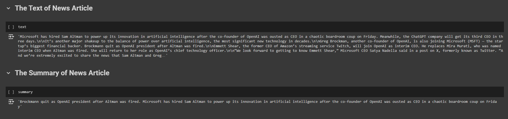

# Extractive Text Summarization of News Articles Using the T5-Base Model

## Project Overview
This project aims to develop an extractive text summarization model for news articles using the T5-Base model (Text-to-Text Transfer Transformer). The goal is to condense long-form news articles into concise, meaningful summaries while retaining the essential information and context of the original content.

The T5 model is a transformer-based text generation model that reformulates all language tasks into a text-to-text format, making it a suitable candidate for summarization tasks. It will be fine-tuned to generate coherent summaries from a news dataset, ensuring that the summaries are accurate, readable, and contextually relevant.

## Dataset
The dataset used is the **BBC News Summary** dataset, which consists of 417 articles published by the BBC between 2004 and 2005. Each article is accompanied by five manually written summaries that provide a brief overview of the article’s content. The first clause of each article serves as the title, giving additional context for the summarization task.

- **Dataset Link**: `gopalkalpande/bbc-news-summary`

### Key Features of the Dataset:
- **Articles**: Full news articles from the BBC.
- **Summaries**: Five human-written summaries per article.
- **Categories**: Each file path corresponds to a class label (e.g., business, sports).

## Objectives
- Build an extractive summarization model to summarize long news articles.
- Fine-tune the T5-Base model to generate human-like summaries.
- Evaluate the model using **ROUGE** metrics to assess the quality of the summaries.
- Apply the model for real-world inference in summarization tasks.

## Methodology
### 1. Data Preparation
- **Exploratory Data Analysis (EDA)**: 
  - Analyzed the dataset to understand the distribution of article lengths and summary lengths.
  - Calculated the average, maximum, and minimum lengths of both articles and summaries.
  - Visualized article lengths and category distribution to understand content variety.

- **Text Preprocessing**:
  - Added the prefix `"summarize:"` to each article to guide the model.
  - Tokenized articles and summaries using the **T5 tokenizer**.

- **Dataset Splitting**: 
  - Split the dataset into **80% training** and **20% validation** sets for model development and evaluation.

### 2. Model Training
- **Model Selection**: 
  - The **T5-Base** model was chosen due to its flexibility in handling text-to-text tasks like summarization.

- **Training Configuration**:
  - Used the **Hugging Face Trainer API** to simplify training.
  - Fine-tuned hyperparameters such as batch size, learning rate, number of epochs, and evaluation steps for optimal performance.
  - Computed metrics such as **ROUGE-1**, **ROUGE-2**, and **ROUGE-L** during training.

- **Training Process**:
  - The model was trained by providing the tokenized articles as input and their corresponding summaries as output.
  - The validation data was used to periodically assess performance, preventing overfitting.

### 3. Inference
After training, the model was used to summarize new articles. The inference process involved:
- Tokenizing the input article.
- Generating the summary using the trained T5 model.
- Decoding the output and returning the final summary.

## Evaluation
The model was evaluated using **ROUGE** metrics, which are widely used in text summarization tasks to compare the overlap between the generated and reference summaries.

### Evaluation Metrics:
- **ROUGE-1**: Overlap of unigrams (single words).
- **ROUGE-2**: Overlap of bigrams (pairs of words).
- **ROUGE-L**: Longest common subsequence (LCS) between the generated and reference summaries.

The model’s performance was monitored throughout the training process using the validation dataset. The best model was saved after each epoch to ensure optimal results.

## Results
The model produced **coherent and concise summaries** that effectively captured the main points of the original news articles. The use of ROUGE metrics demonstrated a strong overlap between the generated and reference summaries.

